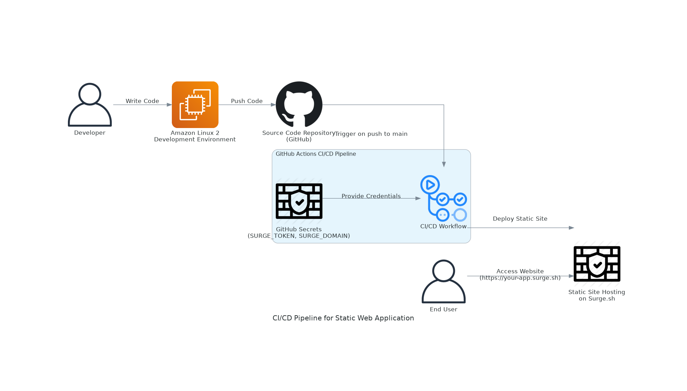

🚀 Zero-Cost Static CI/CD Pipeline
==================================

🔧 Overview
-----------

This project demonstrates a fully automated CI/CD pipeline that builds and deploys a static web application using only free tools and infrastructure.

💡 Features
-----------

*   End-to-end CI/CD with **GitHub Actions**
*   Secure deployment using **GitHub Secrets**
*   Zero-cost hosting with **Surge.sh**
*   Built and tested on **Amazon Linux 2 EC2**
*   Infrastructure visualization with **Amazon Q CLI**

📁 Tech Stack
-------------

*   Amazon Linux 2 (EC2)
*   GitHub + GitHub Actions
*   Surge.sh (static hosting)
*   Amazon Q CLI (diagram visualization)

📸 Image 
-------------

📸 Video
-------------
<video src="assets/video.mp4" controls></video>

📂 Repository
-------------

[View GitHub Repository](https://github.com/trivediayush/ec2-static-cicd-pipeline)

🌐 Live Demo
------------

[ayush-static-cicd.surge.sh](http://ayush-static-cicd.surge.sh)

🧠 Author
------------------
# Ayush Trivedi
